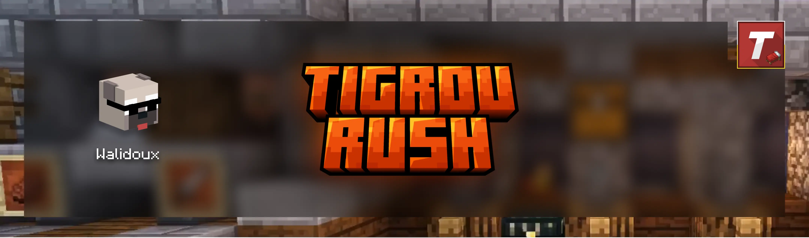

> [!NOTE]
>
> This project is still in development and cannot be used for production use. It is publicly available as a reference implementation of FunCraft's v2 Rush games with lots of extra features which the game desperately needs and can be found under [this game design](https://github.com/walidkorchi/tigrou-rush/wiki). If you wish to try it our Rush games and play with a french-community on an active server or stay up to date with the latest developments, please join us in [TLand Discord private server](https://discord.gg/VxpJy6NCNf).

## ✨ Features

-  

## 🏆 Roadmap

### ⚔️ Implentations

#### 🎨 Textures

- [ ] GUI/GameHostPanelUI : create a GUI for the game host to manage the game room.
- [ ] Allow game host players from their GameHostPanelUI to manage game participants (players/mannequins), hosts must be able to :
  - [ ] Kick players/mannequins from their game room.
  - [ ] Create mannequins : specify their name through an anvil container with a nametag they would typically rename, give them a skill level (BAD, AVERAGE, GOOD, GOD RUSH, HACKER), and assign them a team color from the TeamSelectionGUI.

#### 🛠️ Code

- [ ] `slot_highlight_front` must be taken to consideration to disable inventory slot highlights of empty_slot slots in custom GUIs.

### 🐛 Bugs

<!--none 🎉-->

- [ ] Potion trade is a splash bottle water, not a healing potion
- [ ] GamePlayer no longer take regular fall damage in a running game world
- [ ] flightmode is not removed within the restore lobby state

### 📜 Needs testing but optimistically fixed/implemented

- [ ] Replay worlds do not replicate the record game world state > enderchests with resources generators do not exist in islands with team beds of replay world in contrast to the recorded game world.
- [ ] In a running game room when scenario "Coeurs supplémentaires" is enabled, islands with no teams have no beds, which is contradictory because only destroying beds grants +2 permanent hearts as per game design, a color bed must be assigned respectively. Same thing must applies to replay worlds.
- [ ] Create a helper to color the BannerPatternKeys.PIGLIN banner pattern with visible contrast color either with white or black based on the team color instead of creating a condition for each team color, so the pattern is visible against any background color.
- [ ] In a running game, enderchests and resources spanwers appear only in existing teams islands with beds. As per game design, they appear on all islands by default wether the island has a bed or not.
- [ ] When player dies from void, no killing sound effect is emitted. Usually players take damage for that purpose. It's becausing we are rescusing the player before actually dying, but we need to revive him and make sure that the client player does not render the death screen.
- [ ] In a running game room, mannequins don't die from void which is 20 blocks below the islands the way normal players die and are telported back to their team bed island. > Fix attempt result : The message appears in chat where they did die by getting pushed by another player to the void, but are not teleported back to their team bed island. As per game design, they have a respawn cooldown of 6 seconds, where they are invisible to everyone else which is a state of invulnerability. Currently, the message is spammed infinitely as "%mannequinplayer% est mort"
